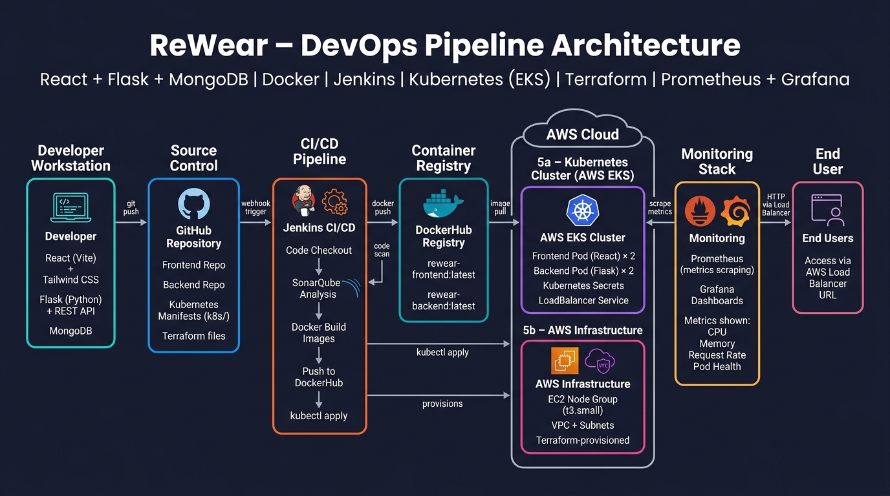
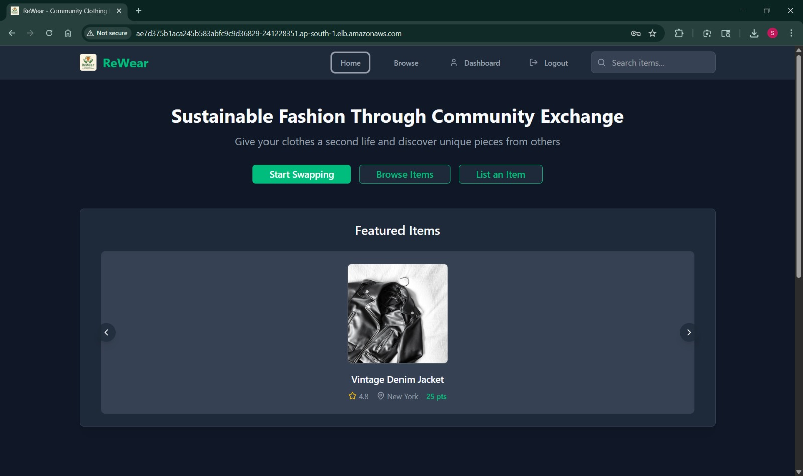
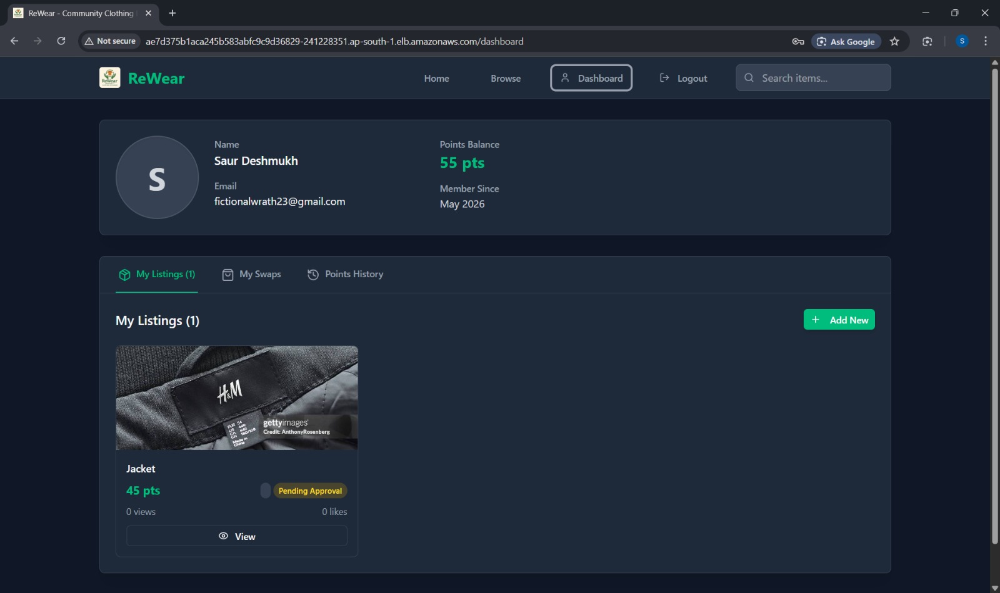
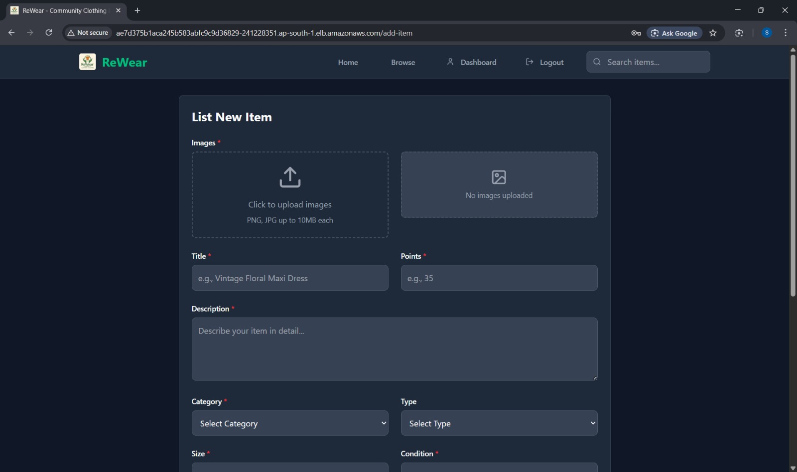
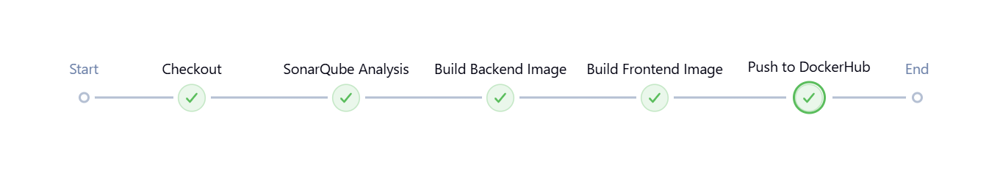
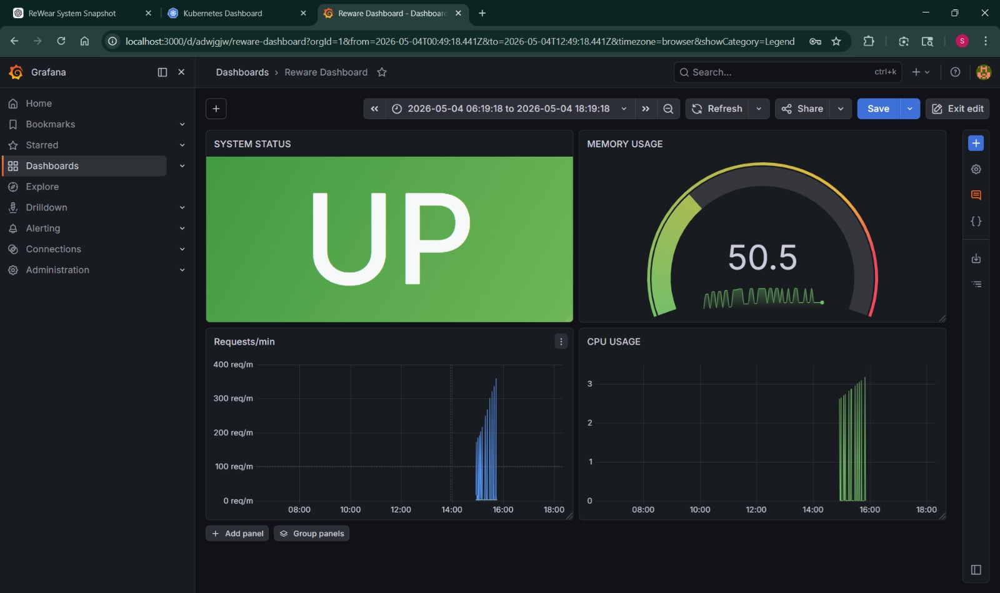

# 🧥 ReWear

### Full Stack Web Application with End-to-End DevOps Pipeline

**Atharva Deokar (2023300042) · Saur Deshmukh (2023300045)**

---

## 🌐 About the Project

**ReWear** is a cloud-native, full-stack web platform that allows users to browse, list, and exchange clothing items. Built with modern technologies and deployed on AWS, it demonstrates a complete production-grade DevOps lifecycle, from a developer's local machine to a live, monitored Kubernetes cluster.

**Key Highlights:**
- 🚀 Fully automated CI/CD from code commit to cloud deployment
- 🐳 Containerized frontend & backend with Docker
- ☸️ Orchestrated on AWS EKS (Elastic Kubernetes Service)
- 📊 Real-time monitoring with Prometheus & Grafana
- 🏗️ Infrastructure provisioned entirely via Terraform

---

## 🏗️ Architecture Diagram

> The diagram below illustrates the complete DevOps pipeline, from developer workstation to end-user access.

---

## 🛠️ Tech Stack

| Layer | Technology |
|---|---|
| **Frontend** | React (Vite), Tailwind CSS |
| **Backend** | Flask (Python), REST APIs |
| **Database** | MongoDB |
| **Containerization** | Docker, Docker Compose |
| **Orchestration** | Kubernetes (AWS EKS) |
| **CI/CD** | Jenkins |
| **Code Quality** | SonarQube |
| **Infrastructure as Code** | Terraform |
| **Monitoring** | Prometheus, Grafana |
| **Cloud** | AWS (EKS, EC2, Load Balancer) |

---

## 📄 Key Configuration Files

| File | Purpose |
|---|---|
| `Jenkinsfile` | Defines the full CI/CD pipeline stages |
| `docker-compose.yml` | Local multi-container development setup |
| `k8s/*.yaml` | Kubernetes deployment, service & secret manifests |
| `terraform/main.tf` | AWS EKS cluster and VPC provisioning |
| `sonar-project.properties` | SonarQube project configuration |
| `monitoring/prometheus-config.yaml` | Prometheus scrape configuration |

---

## 📸 Screenshots

| View | Screenshot |
|---|---|
| Homepage |  |
| Dashboard |  |
| Add Item Form |  |
| Jenkins Pipeline |  |
| Grafana Dashboard |  |

---
